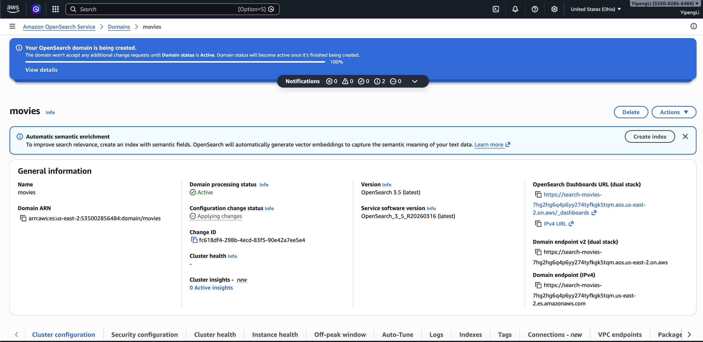
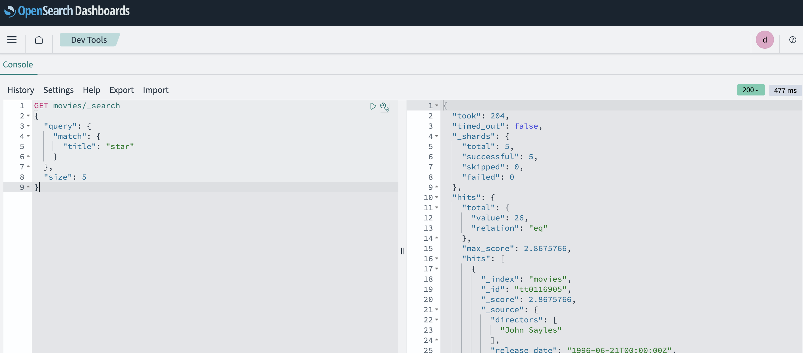
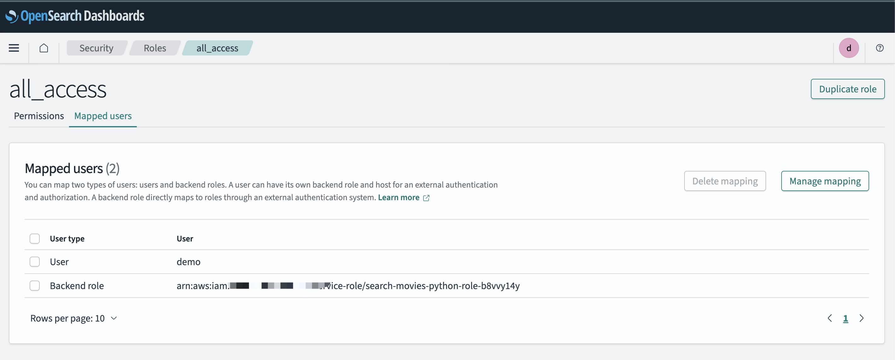
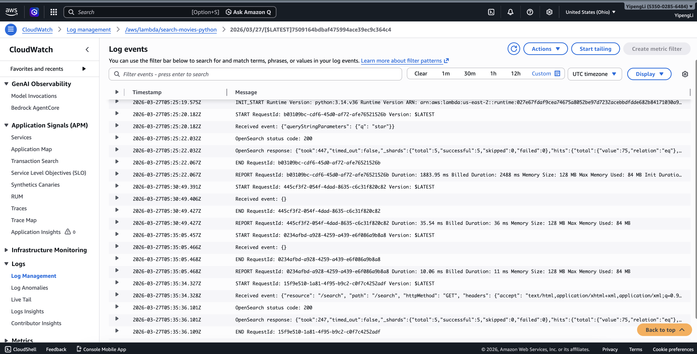
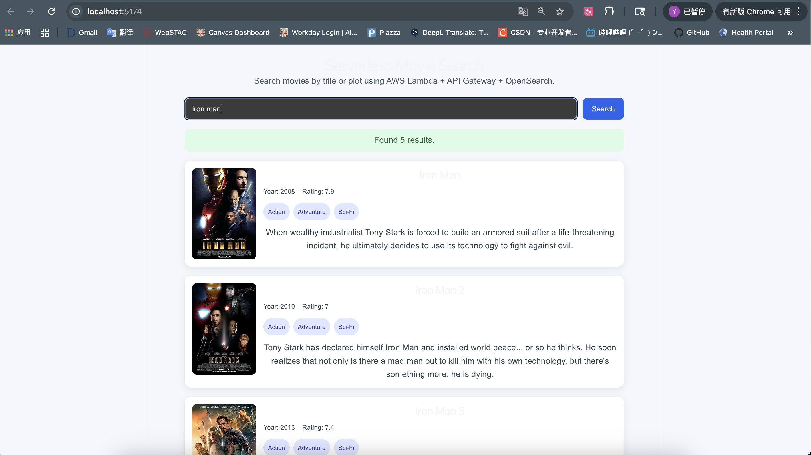

# AWS Serverless Web App (Portfolio)

Serverless backend APIs + search with a React frontend.

## 🚀 Live Demo (APIs)

- **Num2Words (Live):**  
  `GET https://s2y97oaed2.execute-api.us-east-2.amazonaws.com/prod/num2words?num=456`

- **Movie Search (Live):**  
  `GET https://s2y97oaed2.execute-api.us-east-2.amazonaws.com/prod/search?q=star`  
  Required query param: `q`

### Sample response (trimmed)
```json
{
  "query": "star",
  "count": 5,
  "results": [
    {
      "id": "tt0397892",
      "title": "Bolt",
      "year": 2008,
      "rating": 7,
      "genres": ["Animation", "Adventure", "Comedy", "Family", "Sci-Fi"],
      "plot": "The canine star of a fictional sci-fi/action show...",
      "actors": ["John Travolta", "Miley Cyrus", "Susie Essman"],
      "image_url": "https://m.media-amazon.com/images/...",
      "score": 2.8779747
    }
  ]
}

# AWS Serverless Web Application

This project is a portfolio-ready serverless web application built on AWS.  
It combines multiple backend and frontend components into a unified system that demonstrates API design, serverless computing, search integration, cloud storage, and frontend interaction.

The project currently includes two main modules:

- **Num2Words API**
- **Search Movies**

---

## Overview

This project was designed to demonstrate how a serverless web application can be built using AWS managed services.

It uses:

- **AWS Lambda** for backend logic
- **Amazon API Gateway** for HTTP endpoints
- **Amazon OpenSearch Service** for keyword-based movie search
- **Amazon DynamoDB** for persistent data storage
- **React** for frontend interaction
- **Amazon CloudWatch** for debugging and monitoring
- **AWS IAM** and OpenSearch security controls for access management

---

## Modules

### 1. Num2Words API

The Num2Words module accepts an integer input and converts it into English words through a serverless API.

Planned / implemented capabilities:
- Accept integer input through an API
- Convert the number into English words
- Return structured JSON output
- Extend the workflow with DynamoDB history storage
- Support frontend interaction through a web page

Example use case:
- Input: `123`
- Output: `One Hundred Twenty Three`

---

### 2. Search Movies

The Search Movies module provides a serverless movie search experience backed by Amazon OpenSearch Service.

Users can search movie records by keyword, and the system returns matched results from OpenSearch through API Gateway and Lambda. A React frontend is used to provide an interactive search interface.

Implemented capabilities:
- Create and configure an OpenSearch domain
- Import movie data into the `movies` index
- Validate search logic using:
  - `match_all`
  - `match`
  - `multi_match`
- Build a Python Lambda function to query OpenSearch
- Expose a search endpoint through API Gateway
- Build a React frontend to search and display results

Example request:

```text
GET /prod/search?q=star
```

Example response:

```json
{
  "query": "star",
  "count": 5,
  "results": [
    {
      "id": "tt0116905",
      "title": "Lone Star",
      "year": 1996,
      "rating": 7.5
    }
  ]
}
```

---

## Tech Stack

### Backend
- Python
- AWS Lambda

### API Layer
- Amazon API Gateway

### Storage
- Amazon DynamoDB

### Search
- Amazon OpenSearch Service

### Frontend
- React
- JavaScript
- HTML
- CSS

### Monitoring and Debugging
- Amazon CloudWatch

### Security and Access Control
- AWS IAM
- OpenSearch fine-grained access control

---

## Architecture

### Num2Words Flow
Frontend / API Client → API Gateway → Lambda → JSON Response  
Optional extension: Lambda → DynamoDB

### Search Movies Flow
React Frontend → API Gateway → Lambda → OpenSearch → Lambda → Frontend

---

## Search Movies Implementation Details

The Search Movies module was implemented with the following workflow:

1. Create an OpenSearch domain in **us-east-2**
2. Import the sample movie dataset into the `movies` index
3. Validate search behavior directly in OpenSearch Dashboards
4. Build a Lambda function (`search-movies-python`) to query OpenSearch
5. Package Python dependencies into a zip file
6. Configure IAM and OpenSearch role mapping
7. Connect Lambda to API Gateway through `GET /search`
8. Build a React frontend that sends keyword queries and renders movie results

### Query Strategy

The backend uses a `multi_match` query against:
- `title`
- `plot`

Example validated query:

```json
GET movies/_search
{
  "query": {
    "multi_match": {
      "query": "star",
      "fields": ["title", "plot"]
    }
  },
  "size": 5
}
```

---

## Current Status

This project is actively under development.

### Completed
- Repository initialized
- Project structure created
- AWS account setup completed
- Hello World Lambda/API path verified
- Num2Words API minimum working version completed
- OpenSearch domain created
- Movie dataset imported into OpenSearch
- Search query validation completed in Dev Tools
- Search Lambda implemented
- API Gateway `/search` endpoint connected successfully
- React movie search page implemented
- Browser search workflow verified successfully

### In Progress
- DynamoDB-backed history for Num2Words
- Additional frontend polishing
- Project documentation cleanup
- Resume / portfolio packaging

---

## Project Structure

```text
aws-serverless-web-app/
  README.md
  docs/
    notes.md
    screenshots/
  backend/
  frontend/
    movie-search-react/
```

---

## Screenshots

### OpenSearch domain setup


### OpenSearch query validation


### OpenSearch role mapping


### Search API success in CloudWatch


### React frontend demo


---

## Key Takeaways

This project demonstrates:

- Building serverless APIs with AWS Lambda and API Gateway
- Designing cloud-based search workflows with OpenSearch
- Handling authentication and access control with IAM and OpenSearch security settings
- Debugging distributed cloud components with CloudWatch
- Connecting a React frontend to AWS backend services
- Turning cloud assignments into a portfolio-ready engineering project
